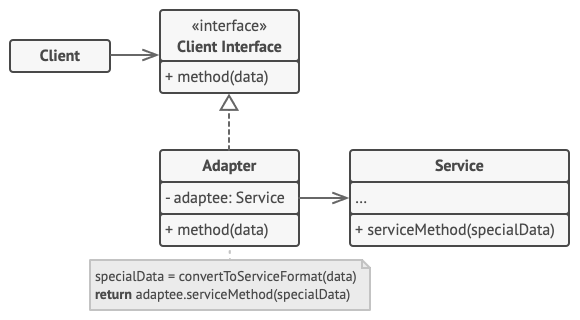

# Design Patterns
### - Singleton (Criacional)
O padrão singleton consiste de uma classe que será instanciada apenas uma vez em todo o sistema. Dessa forma, é possível fornecer um acesso global a esta instância.

No seguinte código, podemos ver o singleton [`MyDatabase`](./src/singleton/db/my-database.ts).

Ele é utilizado no [`index.ts`](./src/singleton/index.ts#L4) e no [`module_a.ts`](./src/singleton/module_a.ts) e ao executar o método [`show()`](./src/singleton/index.ts#L9) percebemos que os dados são mantidos, o que significa que ambos os arquivos estão utilizando a mesma instância do `MyDatabase`.

### - Adapter (Estrutural)
Permite a integração entre objetos que não possuem interfaces compatíveis, serve como um "adaptador" ao realizar a comunicação entre estes objetos.

No código de exemplo, no arquivo [`client.ts`](./src/adapter/client.ts) está sendo implementada a função [`validarEmail()`](./src/adapter/client.ts#L4) que recebe como parâmetros um protocolo de validação, que é estabelecido pela interface [`EmailValidatorProtocol`](./src/adapter/validation/email-validator-protocol.ts), a classe [`EmailValidatorAdapter`](./src/adapter/validation/email-validator-adapter.ts) implementa a interface.
 Dessa forma, é possível alterar a validação de email futuramente sem precisar alterar todas as linhas de código em que a solução é utilizada, ao invés disso, modificamos apenas a classe adapter.

### - Chain of Responsability (Comportamental)
Estabelece uma cadeia para o tratamento de requisições, o que permite que uma requisição passe por vários objetos até que receba o tratamento necessário.

Permite estabelecer a ordem dos objetos na cadeia, a requisição só avançará para o próximo se o objeto atual não puder prover o tratamento ideal.

O modelo de cada "elo" da cadeia neste exemplo é estabelecido pelo [`BaseBudgetHandler`](./src/chain-of-responsability/base-budget-handler.ts)